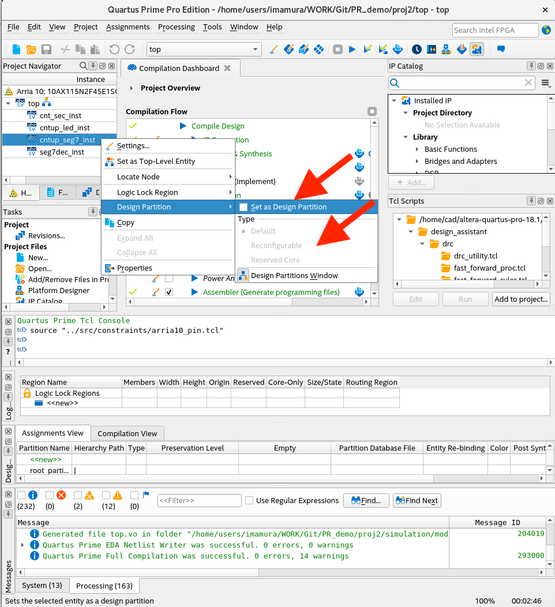
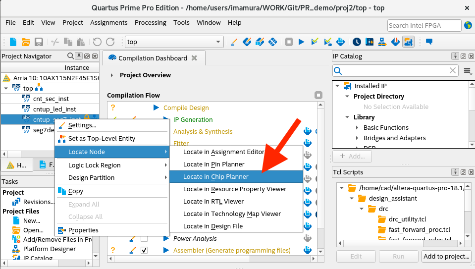
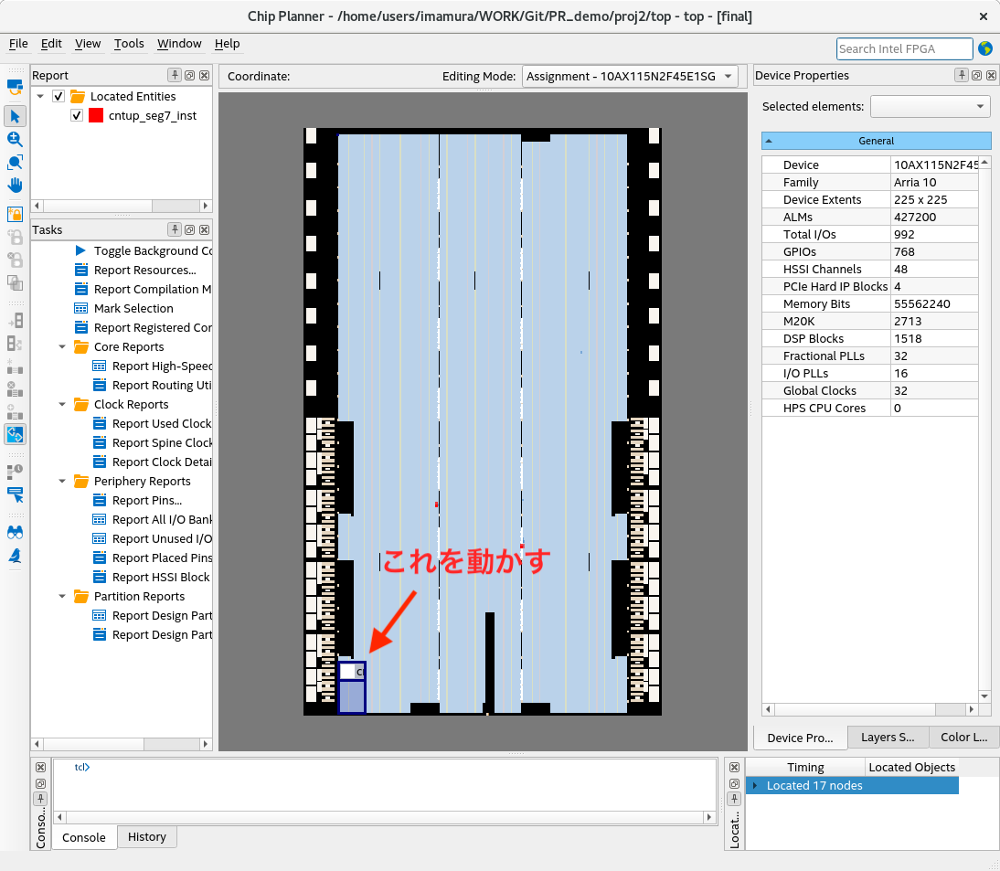
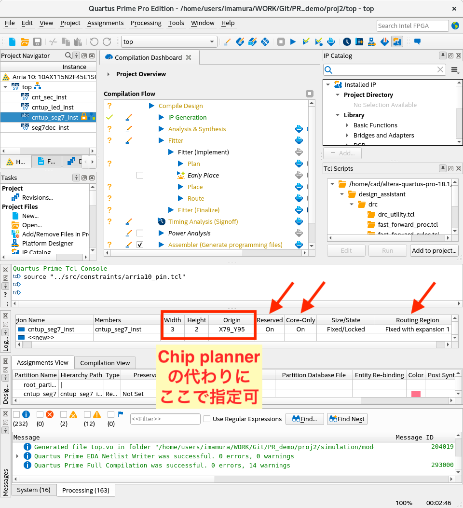
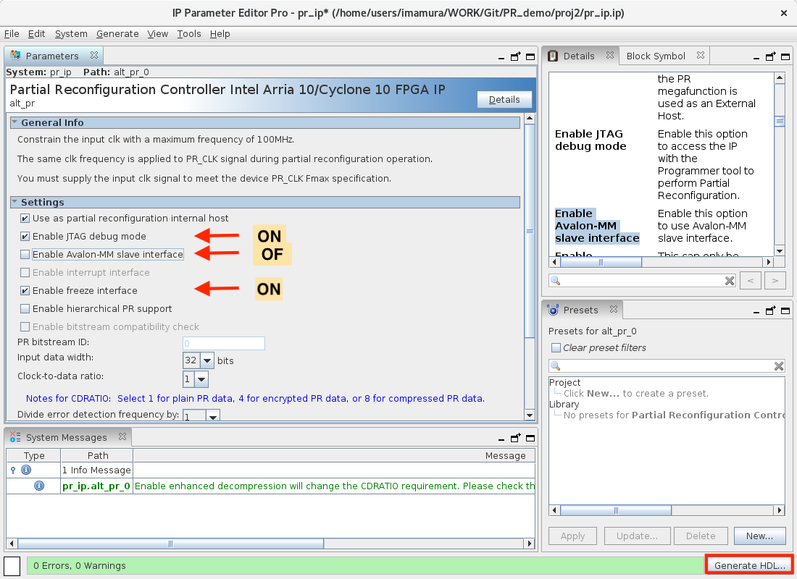
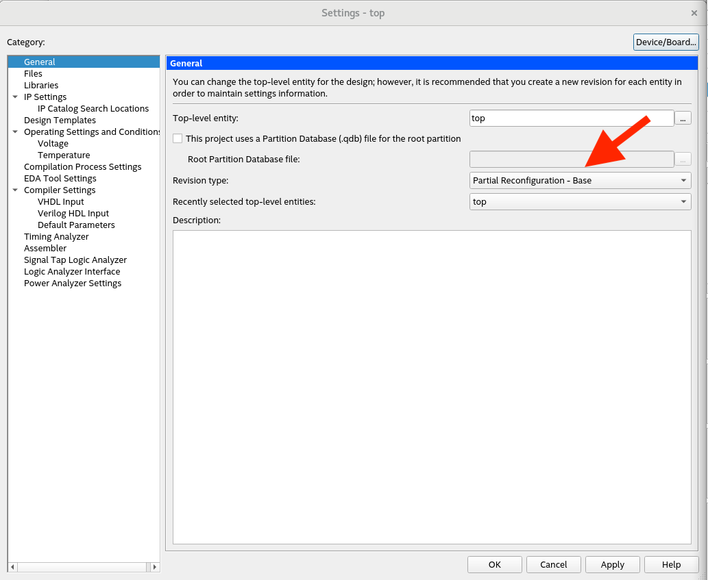
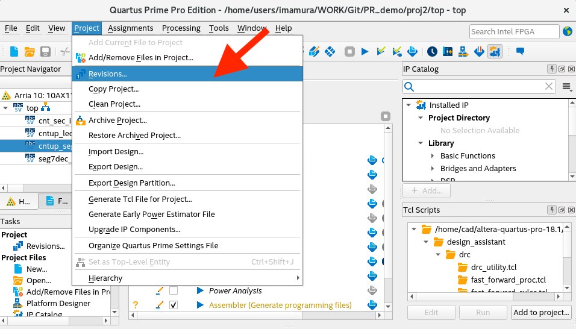
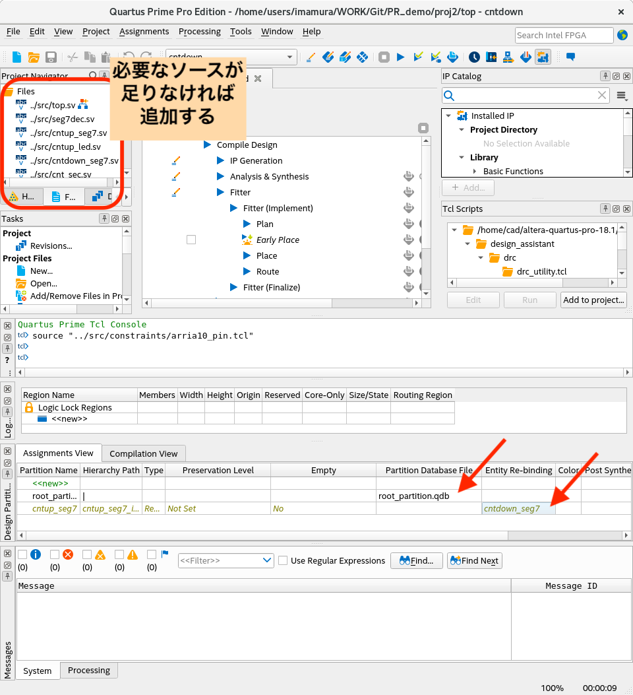

# PR_demo
Intel FPGA 動的再構成チュートリアル


# 環境
|ツール    |Quartus Prime Version 18.1.0 Pro Edition|
|:---------|:---------------------------------------|
|評価ボード|DE5a-Net DDR4 Edition                   |
|FPGA      |Intel Arria10 10AX115N2F45E1SG          |


# 概要
4つのLEDと2つの7セグメントLEDを使って, Intel FPGAで動的再構成を行う手順を確認する.
LEDは常にカウントアップさせ続け, 7セグメントLEDは動的再構成によりカウントアップさせたりカウントダウンさせたりすることで動的再構成の動作を確認する. 動的再構成中は7セグメントLEDが消えるが, LEDの方はカウントアップし続けることを確認することもできる. (動的再構成では再構成中も再構成領域以外の回路は動きつづける)


# ソースコード

| モジュール名   | 内容                                         |         |
|:---------------|:---------------------------------------------|:-------:|
| top            | トップモジュール                             |         |
| cnt_sec        | 1秒をカウントする                            |         |
| seg7dec        | 7セグデコーダ                                |         |
| cntup_led      | ledを光らせる. 4bit count up                 |         |
| cntup_seg7     | 7セグメントLEDをcount upさせる(10進 2桁)     |`default`|
| cntdown_seg7   | 7セグメントLEDをcount downさせる(10進 2桁)   |`PR`     |

`cntup_seg7` と `cntdown_seg7` を動的再構成により入れ替える

# 手順
## 1. ふつうにコンパイルする 

## 2. Design Partition を作る
- Project Navigator の Hierarchy で
  - PRしたいインスタンスを右クリック -> Design Partition -> Set as Design Partition にチェック
  - PRしたいインスタンスを右クリック -> Design Partition -> Reconfigurable を選択
- Design Partitions Window で
  - 名前を編集する（何もしなくてもQuartusが自動的につけてくれる）
- <プロジェクト名>.qsf に以下の文が含まれていることを確認
  ```
  set_instance_assignment -name PARTITION <付けた名前> -to <インスタンス名>
  set_instance_assignment -name PARTIAL_RECONFIGURATION_PARTITION ON -to <インスタンス名>
  ```
<br>


## 3. PR Partition に対して Placement領域とRouting領域を割り当てる
- Project Navigator の Hierarchy で
  - インスタンスを右クリック -> Logic Lock Region -> Create New Logic Lock Region を選択
  <br>
  - インスタンスを右クリック -> Locate Node -> Locate in Chip Planner を選択 -> Chip Plannerのウィンドウが立ち上がる
  <br>
- Chip Planner で
  - 左下の四角い枠を動かしてPR領域の位置と大きさを決める
  - Chip Plannerを立ち上げなくても Logic Lock Regions Window で (height, width, 矩形左下の座標) を指定することで同じことができる
  <br>
- Logic Lock Regions Window で
  - Reserved と Core-Only を ON にする
  - Routing Region をダブルクリックして Fixed with expansion を選択
  <br>
  - <プロジェクト名>.qsf に以下の文が含まれていることを確認
  ```
  set_instance_assignment -name PLACE_REGION "<左下x> <左下y> <右上x> <右上y>" -to <インスタンス名>
  set_instance_assignment -name RESERVE_PLACE_REGION ON -to <インスタンス名>
  set_instance_assignment -name CORE_ONLY_PLACE_REGION ON -to <インスタンス名>
  set_instance_assignment -name ROUTE_REGION "<左下x> <左下y> <右上x> <右上y>" -to <インスタンス名>
  ```
## 4. PR-IP Core を追加する
- IP Catalog で
  - partial reconfiguration を検索 -> Partial Reconfiguration Controller Intel Arria 10/Cyclone 10 FPGA IP を選択 -> ウィンドウが立ち上がる
  - file name を決める(インスタンス化するときに使う)
  - Enable JTAG debug mode と Enable freeze interface オプションにチェック
  - Enable Avalon-MM slave interface オプションのチェックを外す
  - Generate HDL をクリック
  <br>
- PRしたいモジュールをインスタンス化しているファイルで
  - PR-IP Core をインスタンス化
  ```verilog
  wire                      freeze;
  wire [2:0]                pr_ip_status;
  pr_ip pr_ip_inst
    (
     .clk(clk),
     .nreset(1'b1),
     .freeze(freeze),
     .pr_start(1'b0),
     .status(pr_ip_status),
     .data(16'b0),
     .data_valid(1'b0),
     .data_ready()
    );
  ```

## 5. ペルソナを定義する
Base Revision Type を設定する
- 上部のメニューバーで
  - Assignments -> Settings -> General -> Revision Type に「Partial Reconfiguration - Base」を選択
  <br>
  <br>
  - <プロジェクト名>.qsf に以下の文が含まれていることを確認
  ```
  set_global_assignment -name REVISION_TYPE PR_BASE
  ```
Implementation Revisions をつくる
- 上部のメニューバーで
  - Project -> Revisions
  <br>
  - << new revision >> をダブルクリック
  <br>
  - revision名を入力
  - Revision Type に「Partial Reconfiguration - Persona Implementation」を選択
  - This project uses a Partition Database (.qdb)file for the root partition にチェック (名前はつけなくて良い)
  - Set as current revision のチェックを外す
  <br>
  - (revision名).qsfに以下の文が含まれていることを確認
  ```
  set_global_assignment -name REVISION_TYPE PR_IMPL
  ```
  - すべての(Base以外の)revisionに対してこれらを行う

## 6. Base Revision の compile と Static Region の Export
- 上部のメニューバーで
  - Project -> Revisions -> Base Revision を Current Revision に設定 (選択して Set Current をクリック)
  - (プロジェクト名).qsfに以下の文を追加
  ```
  set_global_assignment -name GENERATE_PR_RBF_FILE ON
  set_global_assignment -name ON_CHIP_BITSTREAM_DECOMPRESSION OFF
  ```
- いつも通りコンパイル
- 上部のメニューバーで
  - Project -> Export Design Partition
  - 次のように設定
    | 項目 | 設定 |
    |:-----|:-----|
    | Partition name          | root_partition               |
    | Partition database file | <project>/root_partition.qdb |
    | Inaclude entity-bound SDC files | Enable               |
    | Snapshot                | Final                        |

<br>


## 7. PR Implementation Revisions の準備
- 上部のメニューバーで
  - Project -> Revisions -> PRしたいものを選択し, Set Current をクリック
  - Project -> Add/Remove Files in Project をクリックして正しいソースファイルがあるか確認. なかったら追加する.
- Design Partitions Window で
  - root_partition行, Partition Database File列 に.qdbファイルをセット
  - prしたいpartition行, Entity Re-binding列 にPRしたいモジュール名を入力
  <br>
  - <revision名>.qsfに以下の文が含まれていることを確認
  ```
  set_global_assignment -name ENTITY_REBINDING <セットしたモジュール> -to <インスタンス名>
  ```
  - (revision名).qsfに以下の文を追加
  ```
  set_global_assignment -name GENERATE_PR_RBF_FILE ON
  set_global_assignment -name ON_CHIP_BITSTREAM_DECOMPRESSION OFF
  ```
- ふつうにコンパイル
- すべての(Base以外の)revisionに対してこれらを行う

## 8. ボードに載せる
- Programmer を起動
- .sofファイルを選択して Start
- 載せたファイル(チップのイラスト?)を右クリック -> Add PR Programming File をクリック
- PRしたいモジュールの.rbfファイルを選択
- 最初に載せた .sofファイルの Program/Configure のチェックを外す
- 今載せた .rbfファイルの Program/Configure にチェック
- Start


コマンドで行うなら
- configuration
```
quartus_pgm -c DE5(デバイス名) -m jtag -o p\;<ファイル名>.sof
(セミコロンの後ろにスペースを入れてはいけない)
```
- Partial Reconfiguration
```
quartus_pgm -c DE5(デバイス名) -m jtag -pr <ファイル名>.rbf
```


